# Food Labeling Pipeline Architecture

## Meta
- Purpose: MediaPipe 食事分類モデルのリモートオンデマンド配布パイプラインのアーキテクチャ仕様。既存 GGUF パイプラインとの共存を前提とする。
- Audience: この仕様の PR レビューアおよび実装担当者。
- Update trigger: ダウンロード基盤、Native bridge、ランタイム選択、または学習パイプラインの前提が変わったとき。
- Related docs: [docs/notes/ai-input-assist-mediapipe-static-image-groundwork.md](../notes/ai-input-assist-mediapipe-static-image-groundwork.md), [docs/architecture/tech-spec.md](tech-spec.md), [docs/engineering/food-labeling-guidelines.md](../engineering/food-labeling-guidelines.md)

---

## 1. Problem Statement

現在、MediaPipe 食事分類モデル（`.task`）はアプリに同梱されておらず、`android/app/src/main/assets/mediapipe/` への手動配置を前提としている（[groundwork memo](../notes/ai-input-assist-mediapipe-static-image-groundwork.md)）。
ユーザーが Settings 画面からオンデマンドでダウンロードし、端末内のローカルファイルから推論を実行できるパイプラインを構築する。

---

## 2. End-to-End Pipeline

```mermaid
flowchart LR
  subgraph "Training (Offline)"
    A["labels.jsonl\n(LLM output)"] --> B["export-mediapipe-dataset.py"]
    B --> C["train/val/test dataset\n(9 classes)"]
    C --> D["MediaPipe Model Maker"]
    D --> E[".task file"]
    E --> F["GitHub Releases\n(SHA256 付き)"]
  end

  subgraph "App Download (TS Layer)"
    F --> G["modelInstaller\n(汎用 Downloader Core)"]
    G --> H["SHA256 検証"]
    H --> I["documentDirectory/\nai-models/*.task"]
  end

  subgraph "Inference (Android Native)"
    I --> J["FileInputStream →\nMappedByteBuffer"]
    J --> K["ImageClassifier\n.setModelAssetBuffer()"]
    K --> L["categories[]"]
  end

  subgraph "Normalization (TS Layer)"
    L --> M["mediapipeStaticImage\nNormalizer"]
    M --> N["mealNames[]\ncuisineTypes[]"]
    N --> O["Review UI\n(tap-to-apply)"]
  end
```

---

## 3. Code Alignment: Current State vs Required Changes

本セクションは、既存コードの実態を照合し、変更が必要な箇所とそのリスクを特定します。

### 3.1 TS Download Layer

| ファイル | 現在の実態 | 必要な変更 | リスク |
|---|---|---|---|
| `src/ai/mealInputAssist/modelConfig.ts` L5-19 | `MEAL_INPUT_ASSIST_MODEL_CONFIG` は GGUF の `model` + `projector` の2ファイルをハードコードしている。 | MediaPipe 用の `ModelConfig` を別に定義する。GGUF 用の既存定義はそのまま維持。 | 低。新規追加のみ。 |
| `src/ai/mealInputAssist/modelConfig.ts` L69-82 | `getMealInputAssistManagedFiles()` は `MANAGED_FILE_ORDER = ['model', 'projector']` をハードコードで返す。 | この関数は GGUF 専用のまま維持する。MediaPipe 用に別のファイルリスト取得関数を作る。 | 低。既存関数に手を入れない方針なら安全。 |
| `src/ai/mealInputAssist/modelInstaller.ts` L154-209 | `downloadToTemporaryFile()` は汎用性が高い（`MealInputAssistManagedFile` を受け取る）。 | そのまま再利用できる。ただし `file.key === 'model'` の分岐 (L240-244) は GGUF 前提。 | 中。`installModelFiles` の呼び出し元を分けるか、ファイルリストを引数化する。 |
| `src/ai/mealInputAssist/modelInstaller.ts` L211-277 | `installModelFiles()` 内で `resolveMealInputAssistModelPath()` / `resolveMealInputAssistProjectorPath()` を直接呼び、GGUF の2ファイルに固定されている。 | MediaPipe 用に `installMediaPipeModel()` を別途作る。内部で `downloadToTemporaryFile` を再利用。 | 中。`downloadToTemporaryFile` と `replaceFile` を module-private から export するか、共通 utility に抽出する。 |
| `src/ai/mealInputAssist/modelInstaller.ts` L61-76 | `persistReadyState()` / `persistErrorState()` は GGUF 用の `AppSettingsService.setMealInputAssistModel*` を直接呼ぶ。 | MediaPipe 用の persist 関数を別途作り、異なる設定キーに書き込む。 | 高。**同じキーに書くと GGUF の状態が上書きされる**。必ずキーを分離する。 |

### 3.2 State Management (AppSettingsService)

| ファイル | 現在の実態 | 必要な変更 | リスク |
|---|---|---|---|
| `src/database/services/AppSettingsService.ts` L10-14 | キー定数: `meal_input_assist_model_status`, `meal_input_assist_model_version`, etc. がすべて GGUF 用。 | MediaPipe 用のキー定数を追加: `mediapipe_model_status`, `mediapipe_model_version`, `mediapipe_model_downloaded_at`, `mediapipe_model_error_message`。 | 低。新規キーの追加のみ。既存キーは変更しない。 |
| `src/database/services/AppSettingsService.ts` L56-81 | `getMealInputAssistModelStatus()` 等の getter/setter は GGUF 専用。 | MediaPipe 用の getter/setter を追加（`getMediaPipeModelStatus()` 等）。 | 低。 |

### 3.3 Android Native Layer

| ファイル | 現在の実態 | 必要な変更 | リスク |
|---|---|---|---|
| `MediaPipeMealInputAssistModule.kt` L131-153 | `ensureClassifier()` が `setModelAssetPath(MEDIAPIPE_MEAL_INPUT_ASSIST_MODEL_ASSET_PATH)` を呼び、APK 内 `assets/` のモデルだけを読む。 | `setModelAssetPath` を `setModelAssetBuffer(MappedByteBuffer)` に置き換え、ローカルファイルを読めるようにする。 | **高**。これが本 Issue の核心。詳細は §4 を参照。 |
| `MediaPipeMealInputAssistModule.kt` L155-166 | `hasBundledModelAsset()` が `assets.open()` でモデルの存在を確認する。 | ローカルファイル（`documentDirectory/ai-models/meal-classifier.task`）の存在確認に置き換え。React Native 側からパスを渡すか、Native 側で既知のパスを解決する。 | 中。フォールバック戦略（assets → local file）を入れるか、完全に切り替えるかの判断が必要。 |
| `MediaPipeMealInputAssistModule.kt` L33-40 | `invalidate()` で `classifier?.close()` を呼んでいる。 | 現状のコードは正しくリソースを解放している。MappedByteBuffer 導入後も、この `close()` パスを維持する。 | 低。既存コードが適切。 |
| `MediaPipeMealInputAssistSupport.kt` L9 | `MEDIAPIPE_MEAL_INPUT_ASSIST_MODEL_ASSET_PATH = "mediapipe/meal-input-assist.task"` が assets/ パスとして定義されている。 | ローカルファイルのパスに変更するか、ローカルファイル用の定数を別途追加する。 | 低。 |

### 3.4 TS Provider / Normalizer Layer

| ファイル | 現在の実態 | 必要な変更 | リスク |
|---|---|---|---|
| `src/ai/mealInputAssist/mediapipeStaticImageProvider.ts` L79-111 | `getMediaPipeStaticImageAvailability()` が Native bridge の有無と `getClassifierStatus()` の結果で ready/unavailable を判定する。 | 変更不要。Native 側がローカルファイルを読めるようになれば、この関数は透過的に動く。 | なし。 |
| `src/ai/mealInputAssist/mediapipeStaticImageNormalizer.ts` L19-56 | `LABEL_MAPPING` に 9 エントリ（ramen, udon, soba, sushi, curry_rice, set_meal, dessert, drink, bento）。 | 学習クラス（§5 参照）と整合させる必要がある。現在 `LABEL_MAPPING` にない学習クラス（`fish_dish`, `fried_dish`, `meat_dish`, `noodles`, `simmered_dish`, `stir_fry`）を追加するか、別 Issue で対応する。 | 低（本 Issue のスコープ外としても可）。 |

### 3.5 UI Layer

| ファイル | 現在の実態 | 必要な変更 | リスク |
|---|---|---|---|
| `src/screens/SettingsScreen/SettingsScreen.tsx` L23-33 | import 群が GGUF モデル用の `getMealInputAssistManagedFiles`, `installMealInputAssistModel` 等を参照。 | MediaPipe 用のインストーラー・ステータス取得関数を追加 import する。Hidden Path 方針に従い、まずは開発者向けの表示切替か feature flag で制御する。 | 中。一般ユーザーに未完成の導線を見せないよう注意。 |

---

## 4. Design Decisions

### Decision 1: ローカルファイル読み込み方式

| 案 | 説明 | 判定 |
|---|---|---|
| A. `setModelAssetPath` にローカルパスを渡す | 最小変更。 | ❌ **動作しない。** MediaPipe SDK の `setModelAssetPath(String)` は内部で `context.assets.open()` を呼ぶため、APK 外のファイルパスを渡すと `FileNotFoundException` になる。 |
| B. APK `assets/` にモデルを同梱する | ビルド時バンドル。 | ❌ APK サイズ肥大（+10-20MB）。モデル更新にアプリストアの再デプロイが必要。 |
| C. `setModelAssetBuffer(MappedByteBuffer)` を使う | `FileInputStream` → `FileChannel.map()` でゼロコピー読み込み。 | ✅ ローカルストレージからの読み込みが可能。OS ページキャッシュで高速。モデル差し替えが容易。 |

**採用: 案 C。**

### Decision 2: AppSettings キーの管理

| 案 | 説明 | 判定 |
|---|---|---|
| A. 既存の `meal_input_assist_model_status` を GGUF / MediaPipe 兼用にする | キー数を減らせる。 | ❌ GGUF が `ready` で MediaPipe が `not_installed` の場合に表現できない。**状態が衝突する。** |
| B. MediaPipe 用に独立したキーを新設する（`mediapipe_model_*`） | キーは増えるが完全に分離。 | ✅ 各モデルの状態を独立管理。既存のキーに一切手を入れない。 |

**採用: 案 B。**

### Decision 3: ダウンロード基盤の共通化レベル

| 案 | 説明 | 判定 |
|---|---|---|
| A. `modelInstaller.ts` の `installModelFiles` を汎用化する（引数にファイルリストを受け取る） | 理想的だが、既存の GGUF フローを壊すリスク。 | △ 将来的には望ましいが、本 Issue ではリスクが大きい。 |
| B. `downloadToTemporaryFile` / `replaceFile` などの低レベル関数を共有し、`installMediaPipeModel` を新たに作る | GGUF の `installModelFiles` には手を入れず、共通部品だけ再利用。 | ✅ 既存フローを一切変更せずに MediaPipe を追加可能。 |

**採用: 案 B。** `downloadToTemporaryFile` と `replaceFile` を module 内で共有する。`installModelFiles` 自体のリファクタは別 Issue とする。

---

## 5. Label Taxonomy

学習パイプライン（`scripts/food_label_taxonomy.py` L78-88）は以下の 9 クラスを出力する：

| ID | Training Class | 代表的な source label |
|----|---------------|---------------------|
| 0 | `curry_rice` | curry_rice |
| 1 | `drink` | drink, drinks |
| 2 | `fish_dish` | grilled_fish, sashimi |
| 3 | `fried_dish` | fried_chicken, fried_cutlet, fried_fish |
| 4 | `meat_dish` | grilled_meat, meat_dish |
| 5 | `noodles` | ramen, udon, soba, pasta |
| 6 | `other_or_exclude` | bento, dessert, set_meal, unknown 等 |
| 7 | `simmered_dish` | nimono, stew, meat_and_potato_stew |
| 8 | `stir_fry` | stir_fry |

TS 側の `src/ai/mealInputAssist/mediapipeStaticImageNormalizer.ts` L19-56 の `LABEL_MAPPING` は現在 9 エントリ（ramen, udon, soba 等の個別ラベル）を持つが、モデルが出力するのは上記の coarse class であるため、Normalizer のマッピングを coarse class に合わせて更新する必要がある（別 Issue）。

---

## 6. Security and Integrity

1. **SHA256 Hash Verification**: ダウンロード完了後、`expo-crypto` の `digestStringAsync` でファイルの SHA256 を計算し、`ModelConfig` に記載された期待値と照合する。不一致の場合はファイルを削除しエラーとする。
2. **Atomic Swap**: ダウンロードは一時ファイル（`.download-<timestamp>-<uuid>`）に行い、ハッシュ検証後に `replaceFile()` で最終パスへ移動する。既存の `downloadToTemporaryFile` + `replaceFile` パターンをそのまま踏襲。
3. **MappedByteBuffer の安全性**: 破損したモデルファイルを `setModelAssetBuffer` に渡した場合、MediaPipe SDK 内部で例外が発生する。`ensureClassifier()` の既存の try-catch（`E_CLASSIFIER_INIT_FAILED`）でハンドリングされ、React Native 側にエラーが伝播する。

---

## 7. Out of Scope

本ドキュメントが**扱わない**事項：

- iOS 向けの MediaPipe 対応（現在 Android のみ）。
- GGUF → MediaPipe へのデフォルトランタイムの切替判断（パフォーマンス検証後に別 Issue）。
- MediaPipe モデルの再学習パイプライン（Model Maker の手順改善等）。
- `LABEL_MAPPING` の coarse class 対応（Normalizer の更新は別 Issue）。
- `modelInstaller.ts` の `installModelFiles` 関数自体の汎用化リファクタリング（将来課題）。
