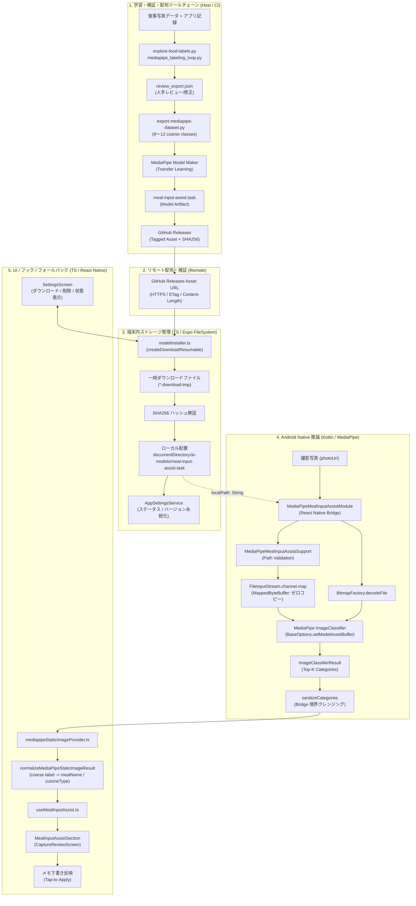

# 食事分類モデル（MediaPipe）リモートオンデマンド配布・ローカル実行アーキテクチャ仕様書

## Meta
- Purpose: MediaPipe 食事分類モデル（`.task`）のアプリ非同梱・リモートオンデマンド配布および端末内ローカルパス読み込み方式のエンドツーエンドアーキテクチャ仕様を定義する。
- Audience: 本機能の実装担当者、AI エージェント、コードレビュアー、リポジトリ保守者。
- Update trigger: モデル配布元、ファイル形式、Native Module インターフェース、ダウンロード・検証契約、UI フォールバック方針が変わったとき。
- Related docs: [AGENTS.md](../../AGENTS.md), [docs/index.md](../index.md), [docs/architecture/tech-spec.md](tech-spec.md), [docs/engineering/food-labeling-guidelines.md](../engineering/food-labeling-guidelines.md), [docs/engineering/mediapipe-labeling-workflow.md](../engineering/mediapipe-labeling-workflow.md), [docs/issues/issue-13-mediapipe-remote-model-pipeline.md](../issues/issue-13-mediapipe-remote-model-pipeline.md)

---

## 1. 概要と背景（Executive Summary & Context）

### 1.1 背景と課題
Dining Memory アプリでは、撮影後の確認画面（Capture Review）においてユーザーの手入力を補助するための「AI 入力補助（Meal Input Assist）」機能を提供している。
現在、大規模モデル（VLM: Qwen2.5-VL）のローカル実行プロトタイプと並行して、軽量・高速・低リソースで食事の大まかなカテゴリ（coarse food categories）を推論可能な **MediaPipe Tasks Vision（Image Classifier）** の統合（`android/app/src/main/java/com/tahosook/diningmemory/MediaPipeMealInputAssistModule.kt`）が進められてきた。

従来の初期検証実装では、モデルファイル（`meal-input-assist.task`）を Android の `assets/` フォルダ配下に手動配置（bundled asset）することを前提としていた。しかし、この方式には以下の課題がある：
1. **アプリバイナリ（APK / AAB）サイズの肥大化**: 数MB〜数十MBのモデルファイルをアプリ本体に同梱すると、初回インストール容量が増加し、ストア配信効率や更新頻度に制約が生じる。
2. **モデル更新の独立性欠如**: ラベル設計の改善や追加学習データによるモデルのバージョンアップを行うたびに、アプリ本体のネイティブ再ビルドおよびストアリリースが必要となる。
3. **リポジトリサイズとライセンスの分離**: Git リポジトリ内に大容量バイナリを追跡させず、モデルの成果物を GitHub Releases 等の外部ストレージに分離管理する必要がある。

### 1.2 解決方針
本仕様では、**MediaPipe 分類モデル（`.task`）をアプリ本体には同梱せず、リモート（GitHub Releases 等）からオンデマンドでダウンロードし、端末のローカルストレージ（`documentDirectory/ai-models/`）に保存した上で、Android Native Module がそのローカルファイルをメモリマップド（MappedByteBuffer）して推論するパイプライン**を確立する。

### 1.3 設計原則（Core Principles）
- **プライバシー保護・完全端末内推論**: 写真データや推論結果は外部サーバーへ送信せず、すべて端末内（on-device）で完結する。ネットワーク通信が発生するのは「モデルデータの初回ダウンロード / 更新時」のみである。
- **手動保存の非妨害（Manual Save First）**: AI は常に optional な入力補助であり、モデルが未ダウンロード、ダウンロード中、または推論失敗時であっても、手動入力および保存操作を決して妨げない。
- **薄い永続化契約（Thin Persistence）**: 保存される AI メタデータは `ai_source` と `ai_confidence` のみとし、生の分類スコアやモデル内部情報はデータベースに保存しない。
- **堅牢なフォールバック**: モデル不在時やエラー時は UI をクラッシュさせず、適切なガイダンス表示（「モデルをダウンロードすると利用できます」）へ自動フォールバックする。

---

## 2. 全体アーキテクチャ（End-to-End Architecture）

食事画像ラベリングからモデル配布、端末内ダウンロード、ネイティブ推論、UI 入力補助までのエンドツーエンドデータフローを以下に示す。



---

## 3. 各レイヤーの責務とインターフェース仕様

### 3.1 レイヤー 1: Python 学習・データセット・配布準備

#### 責務
- 写真データおよび人手レビュー結果から、MediaPipe Image Classifier 向けの一次分類データセット（8〜12 個の coarse classes）を生成する。
- 成果物である `.task` ファイルを生成し、GitHub Releases へ安全に公開する。

#### ラベル体系（Coarse Taxonomy）
`docs/engineering/food-labeling-guidelines.md` に準拠し、一次分類クラスを以下の coarse set に固定する：
- `fried_dish`（揚げ物: 唐揚げ、天ぷら、フライ、餃子等）
- `fish_dish`（焼き魚、煮魚、刺身等）
- `meat_dish`（焼肉、ステーキ、ハンバーグ等）
- `simmered_dish`（煮物、鍋、スープ等）
- `curry_rice`（カレーライス）
- `stir_fry`（炒め物: 野菜炒め、麻婆豆腐等）
- `noodles`（麺類: ラーメン、うどん、そば、パスタ等）
- `drink`（飲料、お酒）
- `other_or_exclude`（主食単体、デザート、弁当、または対象外）

#### 配布アセット仕様（GitHub Releases）
- **タグ規則**: `mediapipe-model-vX.Y.Z`（例: `mediapipe-model-v0.1.0`）
- **アセットファイル**:
  - `meal-input-assist.task`: MediaPipe Tasks Image Classifier モデルバイナリ
  - `meal-input-assist.task.sha256`: SHA256 チェックサムテキスト（`echo "<hash>  meal-input-assist.task" > meal-input-assist.task.sha256`）
- **リリースノート**: 学習データセット件数、評価用混同行列（Confusion Matrix）のサマリー、クラス一覧を明記。

---

### 3.2 レイヤー 2: TypeScript / モデルインストーラー & ダウンロード基盤

#### 責務
- モデルファイルのダウンロード、一時ファイルへの書き込み、ハッシュ完全性検証、アトミックな配置、および削除ライフサイクルを一元管理する。
- 既存の Qwen2.5-VL（GGUF / mmproj）ダウンロード機構と共通の `documentDirectory/ai-models/` を使用し、整合性を保つ。

#### モデル設定定義（`src/ai/mealInputAssist/modelConfig.ts`）
```typescript
export const MEDIAPIPE_MEAL_INPUT_ASSIST_MODEL_CONFIG = {
  version: 'mediapipe-food-v0.1.0',
  fileName: 'meal-input-assist.task',
  url: 'https://github.com/tahosook/dining-memory-app/releases/download/mediapipe-model-v0.1.0/meal-input-assist.task',
  sha256: 'e3b0c44298fc1c149afbf4c8996fb92427ae41e4649b934ca495991b7852b855', // リリースアセットの実ハッシュ
  displayName: 'MediaPipe Food Classifier',
  fileSizeApproxBytes: 15 * 1024 * 1024, // 約15MB
} as const;

export function resolveMediaPipeModelPath(): string | null {
  if (!documentDirectory) {
    return null;
  }
  return `${documentDirectory}${LOCAL_MODEL_DIRECTORY}/${MEDIAPIPE_MEAL_INPUT_ASSIST_MODEL_CONFIG.fileName}`;
}
```

#### ダウンロード・検証・配置フロー（`src/ai/mealInputAssist/modelInstaller.ts`）
1. **ディレクトリ準備**: `resolveMealInputAssistModelDirectoryPath()` を取得し、`makeDirectoryAsync` で作成。
2. **一時ファイルへのダウンロード**:
   - `createDownloadResumable` を使用して `${directoryPath}/${fileName}.download-${Date.now()}-${uuid}` へダウンロード。
   - `onProgress` コールバックにより、ダウンロード進捗率（`bytesWritten / totalBytesExpected`）を UI へ通知。
3. **SHA256 完全性検証**:
   - `expo-crypto` の `digestFileAsync`（またはチャンク読み込み）を用いて、ダウンロード完了ファイルの SHA256 を算出。
   - 設定された `sha256` ハッシュと一致しない場合は、一時ファイルを即座に削除し `Checksum mismatch` エラーをスロー。
4. **アトミック配置**:
   - `replaceFile(tempPath, targetPath)` により、既存ファイルが存在する場合は削除し、`moveAsync` で瞬時に配置。
5. **状態永続化**:
   - `AppSettingsService` に MediaPipe モデルのステータス（`ready` / `error` / `not_installed`）、ダウンロード日時、適用バージョンを記録。

---

### 3.3 レイヤー 3: Android Native Module（Kotlin / MediaPipe Tasks Vision）

#### 責務
- React Native JS 側から渡されたローカルファイルパス（`modelPath`）および写真パス（`photoUri`）を受け取り、静的画像の食事分類推論を実行する。
- 静的画像のデコード、モデルのメモリマッピング、推論実行、結果の正規化サニタイズをバックグラウンドスレッド（`ExecutorService`）で行う。

#### 【最重要】技術的制約と解決設計（Code Alignment Review 結果）
既存の `MediaPipeMealInputAssistModule.kt` では以下のコードが使われていた：
```kotlin
// 旧実装（同梱 asset 前提）
val classifierOptions = ImageClassifier.ImageClassifierOptions.builder()
  .setBaseOptions(
    BaseOptions.builder()
      .setModelAssetPath(MEDIAPIPE_MEAL_INPUT_ASSIST_MODEL_ASSET_PATH) // assets/ 専用！
      .build()
  )
  .build()
```
**課題**:
MediaPipe Tasks Android SDK (`com.google.mediapipe:tasks-vision`) において、`setModelAssetPath(String)` は **Android APK 内の `assets/` フォルダ専用**であり、ローカルファイル（`File` や絶対パス）を渡すと `FileNotFoundException` が発生する。

**解決策**:
ローカルファイルからロードするためには、`FileInputStream` から `FileChannel` を取得し、`MappedByteBuffer`（ダイレクトバッファ）としてマッピングした上で、`BaseOptions.Builder.setModelAssetBuffer(ByteBuffer)` を使用する。
これにより、ヒープを圧迫することなく OS のページキャッシュを活用した高速・安全なゼロコピーロードが実現できる。

```kotlin
// 新設計（ローカルファイルからの MappedByteBuffer ロード）
val modelFile = File(modelPath)
val fileChannel = FileInputStream(modelFile).channel
val mappedByteBuffer: MappedByteBuffer = fileChannel.map(
  FileChannel.MapMode.READ_ONLY,
  0,
  modelFile.length()
)

val baseOptions = BaseOptions.builder()
  .setModelAssetBuffer(mappedByteBuffer)
  .build()

val classifierOptions = ImageClassifier.ImageClassifierOptions.builder()
  .setBaseOptions(baseOptions)
  .setRunningMode(RunningMode.IMAGE)
  .setMaxResults(CLASSIFIER_MAX_RESULTS)
  .build()
```

#### ネイティブインターフェース仕様（ReactMethod）
ステートレスかつ動的なモデル切り替え・キャッシュに対応するため、ReactMethod のシグネチャを以下のように設計する。

```kotlin
@ReactMethod
fun getClassifierStatus(modelPath: String?, promise: Promise)

@ReactMethod
fun classifyStaticImage(photoUri: String, modelPath: String, promise: Promise)
```

1. **`getClassifierStatus(modelPath: String?, promise: Promise)`**:
   - `modelPath` が null または空文字の場合、または指定ファイルが存在しない場合は `{ kind: "unavailable", reason: "Model file not found" }` を返す。
   - 有効なパスであり初期化可能であれば `{ kind: "ready" }` を返す。
2. **`classifyStaticImage(photoUri: String, modelPath: String, promise: Promise)`**:
   - `modelPath` を検証し、同一パスで作成済みの `ImageClassifier` インスタンスが存在すれば再利用する。
   - `modelPath` が前回と異なる場合は、既存の `ImageClassifier` を `close()` し、新たなモデルファイルから再構築する。
   - 写真パス `photoUri` を `resolveLocalPhotoPath` で解決・デコードし、`BitmapImageBuilder` で推論を実行。

#### エラーコード体系
| エラーコード | 発生契機 | クライアント（JS）側のハンドリング |
| :--- | :--- | :--- |
| `E_INVALID_MODEL_PATH` | `modelPath` の形式が不正（URI 構文エラー、空文字） | `model_unavailable` として扱いフォールバック |
| `E_MODEL_MISSING` | 指定された `modelPath` にファイルが存在しない | `model_unavailable`（再ダウンロード誘導） |
| `E_MODEL_LOAD_FAILED` | `FileChannel.map` の I/O エラー、またはモデルファイル破損 | モデル破損通知、再ダウンロード誘導 |
| `E_INVALID_PHOTO_URI` | `photoUri` が `file://` または絶対パスでない | 入力バリデーションエラー |
| `E_PHOTO_MISSING` | 写真ファイルがストレージに見つからない | 写真再撮影・確認誘導 |
| `E_PHOTO_DECODE_FAILED` | 写真のビットマップデコードに失敗（破損・OOM） | エラー通知、手動保存へ誘導 |
| `E_CLASSIFIER_INIT_FAILED` | MediaPipe ネイティブランタイム初期化失敗 | ランタイムエラー通知、手動保存へ誘導 |
| `E_CLASSIFICATION_FAILED` | 推論実行時のネイティブ例外 | エラー通知、手動保存へ誘導 |

---

### 3.4 レイヤー 4: TypeScript Provider / Normalizer / Hook / UI

#### 責務
- ネイティブモジュールと連携し、モデルの配置状態を確認した上で推論をリクエストする。
- ネイティブの推論結果（Top-K categories）を、アプリ共通の `MealInputAssistProviderResult`（`mealNames`, `cuisineTypes`, `noteDraft`）へ安全に正規化する。
- モデル未導入時やエラー時、UI でクラッシュを防止し、適切なメッセージと手動入力導線を提供する。

#### Provider 実装（`src/ai/mealInputAssist/mediapipeStaticImageProvider.ts`）
- `getMediaPipeStaticImageAvailability()`:
  1. `Platform.OS === 'android'` を確認。
  2. `resolveMediaPipeModelPath()` を取得し、ローカルファイルが存在するか確認。
  3. 存在しない場合は `kind: 'unavailable'`, `code: 'model_unavailable'`, `reason: 'MediaPipe 食事分類モデルが端末にダウンロードされていません。設定画面からダウンロードしてください。'` を返す。
  4. Native Module の `getClassifierStatus(modelPath)` を呼び出し、利用可能であれば `kind: 'ready'` を返す。

#### UI フォールバック設計（`useMealInputAssist.ts` & `MealInputAssistSection.tsx`）
- **モデル未ダウンロード時**:
  - `availability.kind === 'disabled'` となり、ボタンは非活性化、または「モデルをダウンロードすると利用できます」のガイダンスを表示。
  - ユーザーは手動で食事名やノートを入力して即座に保存可能（一切のブロッキングなし）。
- **推論エラー発生時**:
  - `setStatus('error')` となり、「端末内解析に失敗しました。もう一度お試しください。」と表示。
  - 手動入力済みのテキストや写真は保持され、そのまま保存可能。

#### 設定画面（`src/screens/SettingsScreen/SettingsScreen.tsx`）の統合
- **AI入力補助セクション**:
  - モデル管理項目に「MediaPipe 食事分類モデル（約15MB）」の状態（未導入 / ダウンロード中 / 利用可能 / エラー）を表示。
  - 「モデルをダウンロード」「再ダウンロード」「モデルを削除」アクションを提供。
  - ダウンロード中はプログレスバーと進捗パーセンテージをリアルタイム表示。

---

## 4. モデル更新・運用ライフサイクル（Model Lifecycle & Ops）

1. **学習データ更新**:
   - `scripts/export-mediapipe-dataset.py` で新しいデータセットを出力。
   - モデルを再学習し、`meal-input-assist.task` を生成。
2. **リリース公開**:
   - GitHub で新しいリリースタグ（例: `mediapipe-model-v0.2.0`）を作成。
   - `meal-input-assist.task` と SHA256 ハッシュを添付。
3. **アプリ側定義更新**:
   - `src/ai/mealInputAssist/modelConfig.ts` の `version`、`url`、`sha256` を更新。
4. **クライアントでの適用**:
   - ユーザーがアプリ起動時または設定画面を開いた際、保存されているバージョンと最新バージョンを比較。
   - 更新がある場合は「新しいモデルが利用可能です」と表示し、ユーザーの明示的タップで差分ダウンロード・アトミック更新を実行。

---

## 5. セキュリティ・プライバシー・ガードレール

1. **モデルの完全性・安全性（Integrity）**:
   - ダウンロード時は HTTPS 接続を強制。
   - ダウンロード完了後に SHA256 チェックサムを照合し、中間者攻撃や不完全ダウンロードによるモデル破損を防止。
2. **プライバシー（Zero Network Inference）**:
   - モデルファイル取得時以外は、一切のネットワーク通信を行わない。
   - 撮影した写真データや推論ログは外部へ送信されず、端末内ローカルでのみ処理される。
3. **メモリ・リソース保護**:
   - `MappedByteBuffer` を使用して不要な Java ヒープ消費を防ぎ、推論終了時には Bitmap を明示的に `recycle()` する。
   - Native Module の `invalidate()` 時に `classifier?.close()` および `worker.shutdown()` を確実に実行し、リークを防ぐ。
