```mermaid
flowchart LR
  subgraph "Training (Offline)"
    A["labels.jsonl\n(LLM output)"] --> B["export-mediapipe-dataset.py"]
    B --> C["train/val/test dataset\n(9 classes)"]
    C --> D["MediaPipe Model Maker"]
    D --> E[".task file"]
    E --> F["GitHub Releases\n(SHA256 付き)"]
  end

  subgraph "App Download (TS Layer)"
    F --> G["modelInstaller\n(汎用 Downloader Core)"]
    G --> H["SHA256 検証"]
    H --> I["documentDirectory/\nai-models/*.task"]
  end

  subgraph "Inference (Android Native)"
    I --> J["FileInputStream →\nMappedByteBuffer"]
    J --> K["ImageClassifier\n.setModelAssetBuffer()"]
    K --> L["categories[]"]
  end

  subgraph "Normalization (TS Layer)"
    L --> M["mediapipeStaticImage\nNormalizer"]
    M --> N["mealNames[]\ncuisineTypes[]"]
    N --> O["Review UI\n(tap-to-apply)"]
  end
```

# Food Labeling Pipeline Architecture

## Meta
- Purpose: MediaPipe 食事分類モデルのリモートオンデマンド配布パイプラインのアーキテクチャ仕様。既存 GGUF パイプラインとの共存を前提とする。
- Audience: この仕様の PR レビューアおよび実装担当者。
- Update trigger: ダウンロード基盤、Native bridge、ランタイム選択、または学習パイプラインの前提が変わったとき。
- Related docs: [docs/notes/ai-input-assist-mediapipe-static-image-groundwork.md](../notes/ai-input-assist-mediapipe-static-image-groundwork.md), [docs/architecture/tech-spec.md](tech-spec.md), [docs/engineering/food-labeling-guidelines.md](../engineering/food-labeling-guidelines.md)

---

## 1. Problem Statement & Multi-Runtime Architecture

現在、MediaPipe 食事分類モデル（`.task`）はアプリに同梱されておらず、`android/app/src/main/assets/mediapipe/` への手動配置を前提としている（[groundwork memo](../notes/ai-input-assist-mediapipe-static-image-groundwork.md)）。
ユーザーが Settings 画面からオンデマンドでダウンロードし、端末内のローカルファイルから推論を実行できるパイプラインを構築する。

アプリは将来的に用途に応じてランタイムを選択できる「マルチランタイム共存」を前提とする。

| 項目 | GGUF Pipeline (Current) | MediaPipe Pipeline (New) |
|---|---|---|
| **Model** | Qwen2.5-VL-3B-Instruct (GGUF + mmproj) | Custom Image Classifier (`.task`) |
| **Runtime** | `llama.rn` (C++ backend) | `tasks-vision` ImageClassifier (Kotlin/Native) |
| **Model Size** | 数 GB（GGUF: 約 1.9GB, Projector: 約 600MB） | 約 10〜20 MB |
| **Memory / Speed** | 高負荷・数秒〜十数秒 | 極めて軽量・数十ミリ秒 |
| **Role / Status** | 汎用画像理解・現デフォルト (`local-runtime-prototype`) | 食事特化分類・当面は **Hidden Path** |

---

## 2. End-to-End Pipeline & Operations

### 2.1 パイプライン全体フロー



### 2.2 モデル配布・運用仕様（GitHub Releases）

モデルの学習からアプリ配布までの運用ライフサイクルを以下のように定義する：

- **リリースタグ規則**: `mediapipe-model-vX.Y.Z`（例: `mediapipe-model-v0.1.0`）
- **アセット構成**:
  - `meal-input-assist.task`: MediaPipe Image Classifier モデルバイナリ（既存の `meal-input-assist.*` 命名規則に準拠）
  - `meal-input-assist.task.sha256`: SHA256 ハッシュテキスト（`echo "<hash>  meal-input-assist.task" > meal-input-assist.task.sha256`）
- **リリースノート記載要件**: 学習データセット件数、混同行列（Confusion Matrix）のサマリー、クラス一覧（9クラス）を明記。

---

## 3. Code Alignment: Current State vs Required Changes

本セクションは、既存コードの実態を照合し、変更が必要な箇所とそのリスクを特定します。

### 3.1 TS Download Layer

| ファイル | 現在の実態 | 必要な変更 | リスク |
|---|---|---|---|
| `src/ai/mealInputAssist/modelConfig.ts` L5-19 | `MEAL_INPUT_ASSIST_MODEL_CONFIG` は GGUF の `model` + `projector` の2ファイルをハードコードしている。 | MediaPipe 用の `ModelConfig` を別に定義する。GGUF 用の既存定義はそのまま維持。 | 低。新規追加のみ。 |
| `src/ai/mealInputAssist/modelConfig.ts` L69-82 | `getMealInputAssistManagedFiles()` は `MANAGED_FILE_ORDER = ['model', 'projector']` をハードコードで返す。 | この関数は GGUF 専用のまま維持する。MediaPipe 用に別のファイルリスト取得関数を作る。 | 低。既存関数に手を入れない方針なら安全。 |
| `src/ai/mealInputAssist/modelInstaller.ts` L154-209 | `downloadToTemporaryFile()` は汎用性が高い（`MealInputAssistManagedFile` を受け取る）。 | そのまま再利用できる。ただし `file.key === 'model'` の分岐 (L240-244) は GGUF 前提。 | 中。`installModelFiles` の呼び出し元を分けるか、ファイルリストを引数化する。 |
| `src/ai/mealInputAssist/modelInstaller.ts` L211-277 | `installModelFiles()` 内で `resolveMealInputAssistModelPath()` / `resolveMealInputAssistProjectorPath()` を直接呼び、GGUF の2ファイルに固定されている。 | MediaPipe 用に `installMediaPipeModel()` を別途作る。内部で `downloadToTemporaryFile` を再利用。 | 中。`downloadToTemporaryFile` と `replaceFile` を module-private から export するか、共通 utility に抽出する。 |
| `src/ai/mealInputAssist/modelInstaller.ts` L61-76 | `persistReadyState()` / `persistErrorState()` は GGUF 用の `AppSettingsService.setMealInputAssistModel*` を直接呼ぶ。 | MediaPipe 用の persist 関数を別途作り、異なる設定キーに書き込む。 | 高。**同じキーに書くと GGUF の状態が上書きされる**。必ずキーを分離する。 |

> [!NOTE]
> **将来的なダウンローダー抽象化（AIModelConfig）の展望**
> 本 Issue ではリスク回避のため `installMediaPipeModel` を新規作成する（Decision 3 参照）が、将来的な共通化のために以下のインターフェース設計を念頭に置く：
> ```typescript
> interface ManagedModelFile {
>   key: string;
>   url: string;
>   targetFileName: string;
>   expectedSha256?: string;
> }
> interface AIModelConfig {
>   version: string;
>   displayName: string;
>   files: ManagedModelFile[];
> }
> ```

### 3.2 State Management (AppSettingsService)

| ファイル | 現在の実態 | 必要な変更 | リスク |
|---|---|---|---|
| `src/database/services/AppSettingsService.ts` L10-14 | キー定数: `meal_input_assist_model_status`, `meal_input_assist_model_version`, etc. がすべて GGUF 用。 | MediaPipe 用のキー定数を追加: `mediapipe_model_status`, `mediapipe_model_version`, `mediapipe_model_downloaded_at`, `mediapipe_model_error_message`。 | 低。新規キーの追加のみ。既存キーは変更しない。 |
| `src/database/services/AppSettingsService.ts` L56-81 | `getMealInputAssistModelStatus()` 等の getter/setter は GGUF 専用。 | MediaPipe 用の getter/setter を追加（`getMediaPipeModelStatus()` 等）。 | 低。 |

### 3.3 Android Native Layer

| ファイル | 現在の実態 | 必要な変更 | リスク |
|---|---|---|---|
| `MediaPipeMealInputAssistModule.kt` L131-153 | `ensureClassifier()` が `setModelAssetPath(MEDIAPIPE_MEAL_INPUT_ASSIST_MODEL_ASSET_PATH)` を呼び、APK 内 `assets/` のモデルだけを読む。 | `setModelAssetPath` を `setModelAssetBuffer(MappedByteBuffer)` に置き換え、ローカルファイルを読めるようにする。 | **高**。本 Issue の核心。 |
| `MediaPipeMealInputAssistModule.kt` L155-166 | `hasBundledModelAsset()` が `assets.open()` でモデルの存在を確認する。 | ローカルファイル（`documentDirectory/ai-models/meal-input-assist.task`）の存在確認に置き換え。 | 中。 |
| `MediaPipeMealInputAssistModule.kt` L33-40 | `invalidate()` で `classifier?.close()` を呼んでいる。 | 現状のコードは正しくリソースを解放している。MappedByteBuffer 導入後も維持する。 | 低。既存コードが適切。 |
| `MediaPipeMealInputAssistSupport.kt` L9 | `MEDIAPIPE_MEAL_INPUT_ASSIST_MODEL_ASSET_PATH` が assets/ パスとして定義されている。 | ローカルファイル用の定数・解決関数を追加する。 | 低。 |

#### Kotlin 実装コードスニペット
ローカルファイルから `MappedByteBuffer` を生成し、MediaPipe にセットする実装：

```kotlin
// Native 側で既定ローカルパス（context.filesDir/ai-models/meal-input-assist.task）を解決
val modelFile = MediaPipeMealInputAssistSupport.resolveDefaultModelFile(reactApplicationContext)
if (!modelFile.exists()) {
  throw FileNotFoundException(MediaPipeMealInputAssistSupport.buildModelMissingReason(modelFile.absolutePath))
}

val mappedByteBuffer: MappedByteBuffer = FileInputStream(modelFile).use { fis ->
  fis.channel.map(FileChannel.MapMode.READ_ONLY, 0, modelFile.length())
}

val classifierOptions = ImageClassifier.ImageClassifierOptions.builder()
  .setBaseOptions(
    BaseOptions.builder()
      .setModelAssetBuffer(mappedByteBuffer)
      .build()
  )
  .setRunningMode(RunningMode.IMAGE)
  .setMaxResults(CLASSIFIER_MAX_RESULTS)
  .build()

val createdClassifier = ImageClassifier.createFromOptions(reactApplicationContext, classifierOptions)
```

#### エラーコード体系とクライアント側ハンドリング

> [!NOTE]
> **ReactMethod 別の返却仕様**:
> - `getClassifierStatus`: モデル不在時や初期化不可時は **Promise を Resolve** し、`{ kind: "unavailable", reason: "..." }` を返す（クラッシュや不要な try-catch を防止）。
> - `classifyStaticImage`: 推論実行時の異常系は **Promise を Reject** し、以下のエラーコードを投げる。

| エラーコード | 発生契機 | クライアント（TS / UI）側のハンドリング |
|:---|:---|:---|
| `E_MODEL_MISSING` | 指定された `modelFile` が端末に存在しない | `model_unavailable`（未インストール状態として再ダウンロード誘導） |
| `E_MODEL_LOAD_FAILED` | `FileChannel.map` の I/O エラー、またはモデルファイル破損 | モデル破損通知、再ダウンロード誘導 |
| `E_INVALID_PHOTO_URI` | `photoUri` が `file://` または絶対パスでない | 入力バリデーションエラー通知 |
| `E_PHOTO_MISSING` | 撮影した写真ファイルがストレージに見つからない | 写真再撮影誘導 |
| `E_PHOTO_DECODE_FAILED` | 写真のビットマップデコード失敗（破損・OOM） | エラー通知、手動保存へ誘導 |
| `E_CLASSIFIER_INIT_FAILED` | MediaPipe ネイティブランタイム初期化失敗 | ランタイムエラー通知、手動保存へ誘導 |
| `E_CLASSIFICATION_FAILED` | 推論実行時のネイティブ例外 | エラー通知、手動保存へ誘導 |

### 3.4 TS Provider / Normalizer Layer

| ファイル | 現在の実態 | 必要な変更 | リスク |
|---|---|---|---|
| `src/ai/mealInputAssist/mediapipeStaticImageProvider.ts` L79-111 | `getMediaPipeStaticImageAvailability()` が Native bridge の有無と `getClassifierStatus()` の結果で ready/unavailable を判定する。 | 変更不要。Native 側がローカルファイルを読めるようになれば、この関数は透過的に動く。 | なし。 |
| `src/ai/mealInputAssist/mediapipeStaticImageNormalizer.ts` L19-56 | `LABEL_MAPPING` に 9 エントリ（ramen, udon, soba, sushi, curry_rice, set_meal, dessert, drink, bento）。 | 学習クラス（§5 参照）と整合させる必要がある。別 Issue で対応。 | 低。 |

### 3.5 UI Layer & フォールバック設計

| ファイル | 現在の実態 | 必要な変更 | リスク |
|---|---|---|---|
| `src/screens/SettingsScreen/SettingsScreen.tsx` L23-33 | import 群が GGUF モデル用の `getMealInputAssistManagedFiles`, `installMealInputAssistModel` 等を参照。 | MediaPipe 用のインストーラー・ステータス取得関数を追加 import する。Hidden Path 方針に従い、まずは開発者向けトグル等で制御する。 | 中。一般ユーザーに未完成の導線を見せないよう注意。 |

#### フォールバック時の具体的な UX ガイダンス
- **モデル未ダウンロード時**:
  - ガイダンス表示: `「MediaPipe 食事分類モデルが端末にダウンロードされていません。設定画面からダウンロードしてください。」`
  - 手動入力フィールド（食事名・ノート・写真）は即時利用可能で、手動保存を決して妨げない。
- **推論エラー発生時**:
  - ガイダンス表示: `「端末内解析に失敗しました。もう一度お試しください。」`
  - ユーザーが手動入力したテキストや撮影した写真は完全に保持され、そのまま保存可能。

---

## 4. Design Decisions

### Decision 1: ローカルファイル読み込み方式

| 案 | 説明 | 判定 |
|---|---|---|
| A. `setModelAssetPath` にローカルパスを渡す | 最小変更。 | ❌ **動作しない。** MediaPipe SDK の `setModelAssetPath(String)` は内部で `context.assets.open()` を呼ぶため、APK 外のファイルパスを渡すと `FileNotFoundException` になる。 |
| B. APK `assets/` にモデルを同梱する | ビルド時バンドル。 | ❌ APK サイズ肥大（+10-20MB）。モデル更新にアプリストアの再デプロイが必要。 |
| C. `setModelAssetBuffer(MappedByteBuffer)` を使う | `FileInputStream` → `FileChannel.map()` でゼロコピー読み込み。 | ✅ ローカルストレージからの読み込みが可能。OS ページキャッシュで高速。モデル差し替えが容易。 |

**採用: 案 C。**

### Decision 2: AppSettings キーの管理

| 案 | 説明 | 判定 |
|---|---|---|
| A. 既存の `meal_input_assist_model_status` を GGUF / MediaPipe 兼用にする | キー数を減らせる。 | ❌ GGUF が `ready` で MediaPipe が `not_installed` の場合に表現できない。**状態が衝突する。** |
| B. MediaPipe 用に独立したキーを新設する（`mediapipe_model_*`） | キーは増えるが完全に分離。 | ✅ 各モデルの状態を独立管理。既存のキーに一切手を入れない。 |

**採用: 案 B。**

### Decision 3: ダウンロード基盤の共通化レベル

| 案 | 説明 | 判定 |
|---|---|---|
| A. `modelInstaller.ts` の `installModelFiles` を汎用化する（引数にファイルリストを受け取る） | 理想的だが、既存の GGUF フローを壊すリスク。 | △ 将来的には望ましいが、本 Issue ではリスクが大きい。 |
| B. `downloadToTemporaryFile` / `replaceFile` などの低レベル関数を共有し、`installMediaPipeModel` を新たに作る | GGUF の `installModelFiles` には手を入れず、共通部品だけ再利用。 | ✅ 既存フローを一切変更せずに MediaPipe を追加可能。 |

**採用: 案 B。** `downloadToTemporaryFile` と `replaceFile` を module 内で共有する。`installModelFiles` 自体のリファクタは別 Issue とする。

---

## 5. Label Taxonomy

学習パイプライン（`scripts/food_label_taxonomy.py` L78-88）は以下の 9 クラスを出力する：

| ID | Training Class | 代表的な source label |
|----|---------------|---------------------|
| 0 | `curry_rice` | curry_rice |
| 1 | `drink` | drink, drinks |
| 2 | `fish_dish` | grilled_fish, sashimi |
| 3 | `fried_dish` | fried_chicken, fried_cutlet, fried_fish |
| 4 | `meat_dish` | grilled_meat, meat_dish |
| 5 | `noodles` | ramen, udon, soba, pasta |
| 6 | `other_or_exclude` | bento, dessert, set_meal, unknown 等 |
| 7 | `simmered_dish` | nimono, stew, meat_and_potato_stew |
| 8 | `stir_fry` | stir_fry |

TS 側の `src/ai/mealInputAssist/mediapipeStaticImageNormalizer.ts` L19-56 の `LABEL_MAPPING` は現在 9 エントリ（ramen, udon, soba 等の個別ラベル）を持つが、モデルが出力するのは上記の coarse class であるため、Normalizer のマッピングを coarse class に合わせて更新する必要がある（別 Issue）。

---

## 6. Security, Integrity & Memory Lifecycle

1. **SHA256 Hash Verification**: ダウンロード完了後、`expo-crypto` の `digestStringAsync` でファイルの SHA256 を計算し、`ModelConfig` に記載された期待値と照合する。不一致の場合はファイルを削除しエラーとする。
2. **Atomic Swap**: ダウンロードは一時ファイル（`.download-<timestamp>-<uuid>`）に行い、ハッシュ検証後に `replaceFile()` で最終パスへ移動する。既存の `downloadToTemporaryFile` + `replaceFile` パターンをそのまま踏襲。
3. **MappedByteBuffer のメモリライフサイクル管理**:
   - `MappedByteBuffer`（Direct Buffer）は Java Heap 外の OS ページキャッシュを使用するため、不要になっても即座に GC されにくい。
   - `invalidate()` などのライフサイクル終了時、または新しいモデルへの差し替え時には `classifier?.close()` を確実に呼び出し、関連するバッファ参照を破棄してメモリリークを防ぐ。
   - 推論終了時には、デコードされた `Bitmap` に対して明示的に `recycle()` を実行する（既存実装準拠）。

---

## 7. Out of Scope

本ドキュメントが**扱わない**事項：

- iOS 向けの MediaPipe 対応（現在 Android のみ）。
- GGUF → MediaPipe へのデフォルトランタイムの切替判断（パフォーマンス検証後に別 Issue）。
- MediaPipe モデルの再学習パイプライン（Model Maker の手順改善等）。
- `LABEL_MAPPING` の coarse class 対応（Normalizer の更新は別 Issue）。
- `modelInstaller.ts` の `installModelFiles` 関数自体の汎用化リファクタリング（将来課題）。
