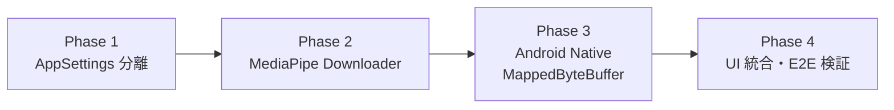

# Issue 13: MediaPipe Remote Model Pipeline

## Meta
- Purpose: MediaPipe 食事分類モデルのリモート配布パイプラインを実装するためのタスク仕様。
- 内部ドキュメントID: issue-13
- 対応 GitHub Issue: 未起票
- Audience: 実装担当者および PR レビューア。
- Update trigger: 各 Phase の受入基準やスコープが変わったとき。
- Related docs: [docs/architecture/food-labeling-pipeline.md](../architecture/food-labeling-pipeline.md), [docs/notes/ai-input-assist-mediapipe-static-image-groundwork.md](../notes/ai-input-assist-mediapipe-static-image-groundwork.md)
- Status: open

---

## Prerequisites

- [docs/architecture/food-labeling-pipeline.md](../architecture/food-labeling-pipeline.md) の全体像と Design Decisions を理解済みであること。
- MediaPipe path は Hidden Path（デフォルトランタイムに切り替えない）の原則を遵守すること。

---

## Phase Dependencies

Phase 1 → 2 → 3 → 4 の順序で実装する。各 Phase は前の Phase の完了に依存する。

---

## Phase 1: AppSettingsService への MediaPipe 用キー追加

GGUF の状態管理と衝突しない MediaPipe 専用のキーを `AppSettingsService` に追加する。

### 変更対象ファイル
- `src/database/services/AppSettingsService.ts`

### タスク
- [ ] 以下のキー定数を追加する:
  - `mediapipe_model_status` (`'not_installed' | 'ready' | 'error'`)
  - `mediapipe_model_version`
  - `mediapipe_model_downloaded_at`
  - `mediapipe_model_error_message`
- [ ] 対応する getter/setter メソッドを追加する（`getMediaPipeModelStatus()`, `setMediaPipeModelStatus()` 等）。
- [ ] 既存の `meal_input_assist_model_*` キーおよびメソッドは一切変更しない。

### 受入基準
- 既存テスト（`tests/` 配下の AppSettingsService 関連）がすべて通過すること。
- 新規キーの get/set が正しく動作すること（手動確認 or テスト追加）。
- GGUF 用の `getMealInputAssistModelStatus()` の動作に影響がないこと。

---

## Phase 2: MediaPipe モデル用ダウンローダー追加

既存の `modelInstaller.ts` 内の低レベル関数（`downloadToTemporaryFile`, `replaceFile`, `cleanupFile`）を再利用し、MediaPipe 専用のインストール関数を追加する。

### 変更対象ファイル
- `src/ai/mealInputAssist/modelConfig.ts` — MediaPipe 用の設定追加
- `src/ai/mealInputAssist/modelInstaller.ts` — MediaPipe 用インストール関数追加
- `src/ai/mealInputAssist/types.ts` — 必要に応じて MediaPipe ステータス型追加
- `src/ai/mealInputAssist/index.ts` — barrel export 更新

### タスク
- [ ] `modelConfig.ts` に MediaPipe モデルの設定を追加する:
  - GitHub Releases の URL
  - ファイル名: `meal-input-assist.task`（既存命名規則に準拠）
  - SHA256 ハッシュ
  - バージョン文字列
- [ ] `modelInstaller.ts` に以下を追加する:
  - `installMediaPipeModel(options?)` — 一時ファイルへのダウンロード → SHA256 検証 → `replaceFile`（Temporary Download + Verified Replacement）で配置 → Phase 1 のキーに状態を永続化。
  - `getMediaPipeModelStatus()` — ローカルファイルの存在確認と設定キーの読み取り。
  - `deleteMediaPipeModel()` — ファイル削除と状態リセット。
- [ ] **既存の `installModelFiles()` / `installMealInputAssistModel()` / `redownloadMealInputAssistModel()` / `deleteMealInputAssistModel()` は変更しない。**
- [ ] SHA256 検証は、全量メモリ読み込みを避けるため Native 側（Kotlin の `MessageDigest` ストリーミング処理、またはロード時検証）と連携したメモリ安全な方式を採用する（`expo-crypto.digestStringAsync` による全量 Base64 読み込みは行わない）。

### 受入基準
- GGUF のダウンロード・削除フローが引き続き正常に動作すること。
- MediaPipe モデルのダウンロード後、`documentDirectory/ai-models/meal-input-assist.task` にファイルが配置され、`getMediaPipeModelStatus()` が `{ kind: 'ready' }` を返すこと。
- SHA256 が不一致の場合、ファイルが削除され `{ kind: 'error' }` が返ること。
- ダウンロード中に異常終了した場合、一時ファイルがクリーンアップされること。
- 万一 `replaceFile` の削除直後にプロセスが中断した場合でも、次回起動時に `getInstalledFileState()` が欠落を検知して安全に再ダウンロード可能であること。

### ロールバック
追加した関数・型・設定を削除すれば完全に元に戻る。既存コードを変更しないため、revert は安全。

---

## Phase 3: Android Native の MappedByteBuffer 対応

`MediaPipeMealInputAssistModule.kt` の `ensureClassifier()` を変更し、APK assets/ ではなくローカルストレージのモデルファイルを `MappedByteBuffer` 経由で読み込めるようにする。

### 変更対象ファイル
- `android/.../MediaPipeMealInputAssistModule.kt` — `ensureClassifier()` の読み込みロジック変更
- `android/.../MediaPipeMealInputAssistSupport.kt` — パス定数および解決関数 `resolveDefaultModelFile` の追加

### タスク
- [ ] `MediaPipeMealInputAssistSupport.kt` に、既定ローカルモデルファイル（`context.filesDir/ai-models/meal-input-assist.task`）を取得する `resolveDefaultModelFile(context: Context): File` を新設する。
- [ ] `ensureClassifier()` (現在 L131-153) を以下のように変更する:
  1. `resolveDefaultModelFile(reactApplicationContext)` から `File` オブジェクトを取得（ReactMethod のシグネチャは維持）。
  2. `FileInputStream(file).use { fis -> fis.channel.map(FileChannel.MapMode.READ_ONLY, 0, file.length()) }` で `MappedByteBuffer` を取得。
  3. `BaseOptions.builder().setModelAssetBuffer(mappedBuffer)` でオプションを構築。
- [ ] `hasBundledModelAsset()` (現在 L155-166) をローカルファイルの存在確認（`resolveDefaultModelFile(context).exists()`）に置き換える。
- [ ] 既存の `invalidate()` (L33-40) の `classifier?.close()` パスはそのまま維持する。
- [ ] モデルファイルが存在しない場合の `FileNotFoundException` ハンドリングおよびエラーコード体系（`E_MODEL_MISSING`, `E_MODEL_LOAD_FAILED`, `E_CLASSIFIER_INIT_FAILED` 等）を `food-labeling-pipeline.md` §3.3 に準拠して整備する。

### 受入基準
- `documentDirectory/ai-models/meal-input-assist.task` にモデルファイルを配置した状態で `classifyStaticImage` を呼び、`categories[]` が返ること（実機 or エミュレータ）。
- モデルファイルが存在しない場合、`getClassifierStatus` が `{ kind: 'unavailable' }` を返し、クラッシュしないこと。
- `invalidate()` 呼び出し後、`classifier` が null になりリソース（Direct Buffer）が適切に解放されること。
- 破損したファイルを配置した場合、`E_MODEL_LOAD_FAILED` または `E_CLASSIFIER_INIT_FAILED` エラーが React Native 側に伝播すること。

### ロールバック
`ensureClassifier()` を `setModelAssetPath` に戻せば完全に元に戻る。

---

## Phase 4: UI 統合と E2E 検証（Hidden Path）

一般ユーザーの体験を壊さず、開発者が MediaPipe モデルをテストできる導線を SettingsScreen に追加する。

### 変更対象ファイル
- `src/screens/SettingsScreen/SettingsScreen.tsx` — MediaPipe セクション追加
- 関連フック（必要に応じて新規作成）

### タスク
- [ ] SettingsScreen に MediaPipe モデルの状態表示・ダウンロード・削除の UI を追加する。
  - **表示条件**: `__DEV__` フラグ、または feature flag によって表示を制限する。一般ユーザーには見せない。
- [ ] ダウンロード → 設定画面のステータスが `ready` に切り替わることを確認する。
- [ ] 写真撮影 → `classifyStaticImage` → 推論結果が Review UI に表示されることを E2E で確認する。
- [ ] モデル未導入時および推論失敗時のフォールバックガイダンス文言（`food-labeling-pipeline.md` §3.5）が正しく表示され、手動入力・保存がブロックされないことを確認する。

### 受入基準
- Development ビルドで SettingsScreen に MediaPipe セクションが表示されること。
- Production ビルド（または feature flag オフ時）に MediaPipe セクションが表示されないこと。
- ダウンロード → 推論 → 結果表示の一連のフローが実機で動作すること。
- モデル未導入時・エラー時でも手動入力・保存が一切妨げられないこと。
- GGUF モデルの既存のダウンロード・推論フローに影響がないこと。

### ロールバック
SettingsScreen の MediaPipe セクションを削除すれば完全に元に戻る。

---

## Out of Scope

- iOS 対応。
- GGUF → MediaPipe へのデフォルトランタイム切替判断。
- `LABEL_MAPPING` の coarse class 対応（Normalizer 更新）。
- `installModelFiles` 自体の汎用化リファクタリング。
- MediaPipe モデルの再学習パイプライン改善。
